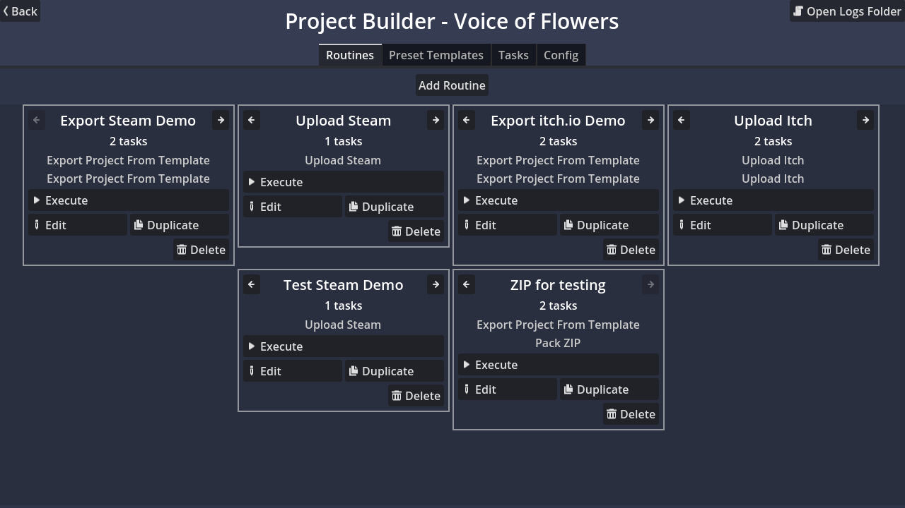
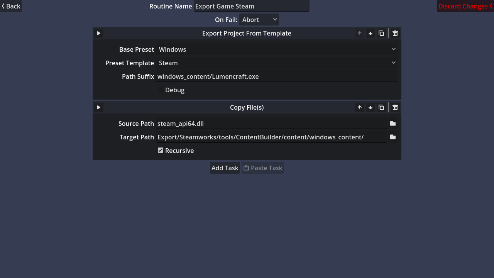
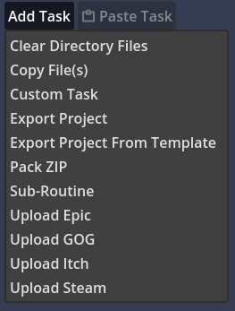

#  Godot Project Builder

Godot Project Builder is an automation tool made in Godot Engine and focused on exporting and publishing Godot projects. The builder works by running "routines", which are composed of "tasks". Each task involves running a predefined command with customized arguments. The builder comes with numberous built-in tasks, which include exporting project, publishing to popular stores (Steam, GOG, Epic, itch.io), and file operations. Task setup is fully visual.

## Overview

Project Builder can be launched from a release executable or from source using Godot Engine (4.3 or newer). When you start Project Builder, the first thing you will see is the project list.

It's similar to Godot's own Project Manager, but more minimal. It automatically lists the projects you have registered in Godot, with information whether Project Builder is configured for that project and how many routines it has. Clicking a project will open the main project view.

It shows projects title at the top and is divided in to 4 tabs: Routines, Templates, Tasks and Config. They are explained below.

### Routines

This tab shows overview of all routines in your project. You can create a routine by clicking Add Routine button, which will add an empty one:

From the main view, routines can be executed, edited, duplicated or deleted. When you create and edit a routine, it will be automatically saved in a dedicated project build configuration file stored in your project's folder. By default the file is located at `res://project_builds_config.txt`.

#### Editing Routines

By clicking the Edit button in a routine, you will open an editing screen where you can assign tasks to a routine.

On this screen you'll see a list of all tasks assigned to the routine. You can add a task by clicking Add Task button and selecting a task from the list.

After the task is added, you can use its controls to setup it. Reference about task usages and its cofniguration is available in the [Tasks](#tasks) tab or in the [task list](#list-of-available-tasks) in this README.

At the top of the task preview is its title and various buttons. The top-left button allows you to quickly execute a single task from the routine (see [Executing](#executing)). The top-right are buttons for rearranging tasks, a Copy button and a Delete button. Copy will copy the task data into an internal clipboard and you will be able to paste the task into the same routine, other routines, or even other projects. The Delete button requires double-click to activate, to prevent accidental deleting. A deleted task cannot be recovered, as currently the Project Builder does not support undo/redo.

Above the task list is the routine name field, where you can rename it. Note that each routine needs an unique name and if there is a conflict, you won't be able to leave this screen (unless you use the Discard Changes button). Clicking Back will go back to the main screen and save the routine. The routine is also saved when you close the Project Builder.

#### Executing

### Templates

### Tasks

### Config

### Project Builder Plugin

## List of Available Tasks

### Clear Directory Files

### Copy Files(s)

### Custom Task

### Export Project

### Export Project From Template

### Pack ZIP

### Sub-Routine

### Upload Epic

### Upload GOG

### Upload Itch

### Upload Steam
___
You can find all my addons on my [profile page](https://github.com/KoBeWi).

